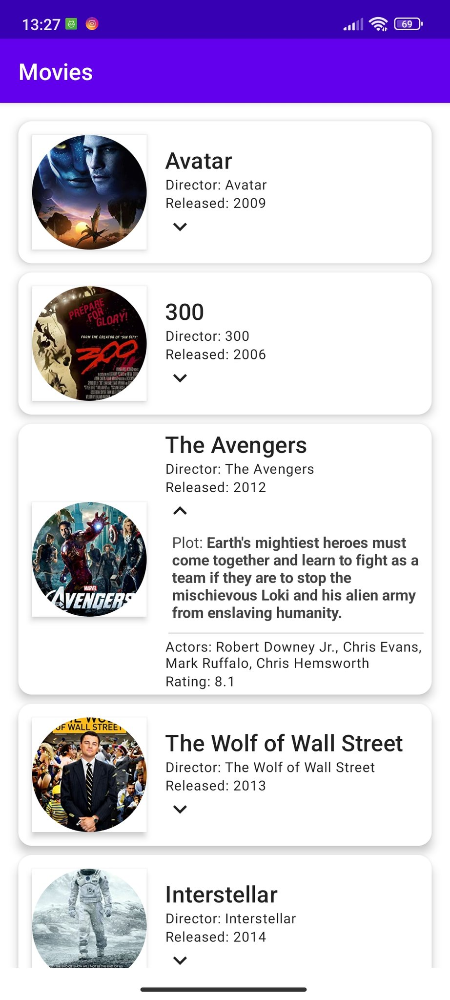

# MovieApp-Compose
I built the project with Jetpack Compose  and dummy data.

## USED:
* Jetpack-Compose
* Navigation-Compose: 2.5.0
* Coil for Image Loading: 2.1.0
* LazyColumn, LazyRow
* AnimatedVisibility for expanded card

 </img>
 </img>
